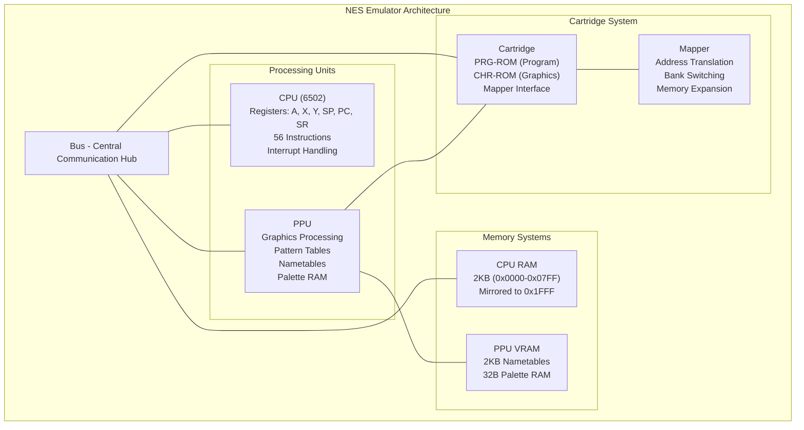
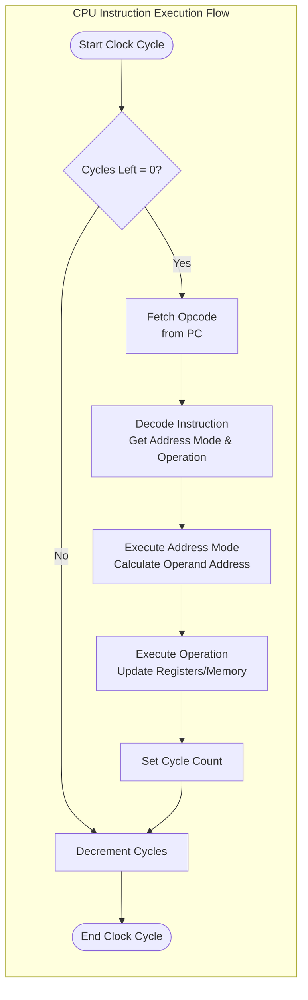

# NES Emulator Architecture

A complete Nintendo Entertainment System (NES) emulator written in C++. This emulator accurately recreates the behavior of the original NES hardware through component-based architecture.

## 🏗️ Architecture Overview

The emulator follows a modular design that mirrors the actual NES hardware architecture. Each major component is implemented as a separate class with well-defined interfaces.



## 🧩 Core Components

### 1. Bus System (`Bus.hpp`, `Bus.cpp`)

The **Bus** acts as the central communication backbone, connecting all system components and routing memory accesses.

**Key Features:**
- **Central Hub**: Connects CPU, PPU, RAM, and Cartridge
- **Memory Routing**: Routes read/write operations based on address ranges
- **Address Mirroring**: Handles NES memory mirroring (RAM mirrors, PPU register mirrors)
- **Clock Coordination**: Manages system timing and synchronization

**Memory Map Handled:**
| Address Range | Component | Description |
|---------------|-----------|-------------|
| `0x0000-0x1FFF` | CPU RAM | 2KB RAM with mirroring |
| `0x2000-0x3FFF` | PPU | PPU registers with mirroring |
| `0x4000-0x4017` | APU/IO | Audio and I/O registers |
| `0x4020-0xFFFF` | Cartridge | Game ROM and mapper registers |

**Key Methods:**
- `cpuRead(Address, bool)`: Routes CPU read operations
- `cpuWrite(Address, Byte)`: Routes CPU write operations
- `insertCartridge()`: Connects a cartridge to the system
- `reset()`: Resets the entire system
- `clock()`: Advances the system by one clock cycle

### 2. CPU System (`CPU.hpp`, `CPU.cpp`)

The **CPU** emulates the 6502 microprocessor used in the NES, handling instruction execution and system control.

**Architecture:**
- **Registers**: Accumulator (A), Index registers (X, Y), Stack Pointer (SP), Program Counter (PC), Status Register (SR)
- **Instruction Set**: 56 legal 6502 instructions with various addressing modes
- **Interrupt Support**: Reset, IRQ (maskable), NMI (non-maskable)

**Instruction Execution Flow:**


**Addressing Modes:**
- `IMP`: Implied
- `IMM`: Immediate
- `ZP0`: Zero Page
- `ZPX/ZPY`: Zero Page with X/Y offset
- `ABS`: Absolute
- `ABX/ABY`: Absolute with X/Y offset
- `IND`: Indirect
- `IZX/IZY`: Indexed Indirect
- `REL`: Relative (for branches)

**Status Register Flags:**
- `C`: Carry
- `Z`: Zero
- `I`: Interrupt Disable
- `D`: Decimal Mode
- `B`: Break
- `U`: Unused
- `V`: Overflow
- `N`: Negative

### 3. PPU System (`PPU.hpp`, `PPU.cpp`)

The **Picture Processing Unit** handles all graphics rendering and video output.

**Key Features:**
- **Pattern Tables**: Store sprite and background graphics data (8KB)
- **Nametables**: Define screen layout and tile placement (2KB VRAM)
- **Palette RAM**: Color information for sprites and backgrounds (32 bytes)
- **Cartridge Interface**: Direct access to CHR-ROM/RAM

**Memory Organization:**
- **Pattern Tables**: `0x0000-0x0FFF` (CHR-ROM/RAM from cartridge)
- **Nametables**: `0x2000-0x27FF` (internal VRAM)
- **Palettes**: `0x3F00-0x3FFF` (internal palette RAM)

**Key Methods:**
- `cpuRead/cpuWrite()`: CPU interface to PPU registers
- `ppuRead/ppuWrite()`: Direct PPU memory access
- `ConnectCartridge()`: Links PPU to cartridge graphics data
- `clock()`: Advances PPU rendering by one pixel

### 4. Cartridge System (`Cartridge.hpp`, `Cartridge.cpp`)

The **Cartridge** represents the game ROM and handles loading and accessing game data.

**Components:**
- **PRG-ROM**: Program code and data (CPU accessible)
- **CHR-ROM/RAM**: Graphics data (PPU accessible)
- **Mapper**: Address translation and bank switching logic
- **iNES Header**: ROM file format information

**ROM Loading Process:**
1. Parse iNES header to determine ROM sizes and mapper type
2. Load PRG-ROM data into memory vectors
3. Load CHR-ROM data (or allocate CHR-RAM)
4. Instantiate appropriate mapper based on mapper ID
5. Connect to both CPU (via bus) and PPU directly

**Key Features:**
- **Dynamic Loading**: Supports loading different ROM files
- **Mapper Support**: Extensible mapper system for various cartridge types
- **Memory Banking**: Handles games larger than native NES address space

### 5. Mapper System (`Mapper.hpp`, `Mapper_000.hpp`)

**Mappers** handle address translation and enable games to use more memory than the NES natively supports.

**Base Mapper Interface:**
- `cpuMapRead/Write()`: Translate CPU addresses to ROM addresses
- `ppuMapRead/Write()`: Translate PPU addresses to CHR addresses
- Bank count tracking for PRG and CHR memory

**Mapper 000 (NROM):**
- Simplest mapper for basic games
- Direct address mapping with optional mirroring
- Supports 16KB or 32KB PRG-ROM
- Supports 8KB CHR-ROM or CHR-RAM

**Address Translation:**
- CPU addresses `0x8000-0xFFFF` → PRG-ROM
- PPU addresses `0x0000-0x1FFF` → CHR-ROM/RAM
- Handles mirroring for smaller ROMs

## 🔄 System Operation Flow

### 1. Initialization
1. Create Bus instance
2. Connect CPU and PPU to Bus
3. Load cartridge (ROM file)
4. Insert cartridge into Bus
5. Reset system to initial state

### 2. Emulation Loop
```cpp
while (running) {
    bus.clock();  // Advance entire system by one clock cycle
}
```

### 3. Clock Synchronization
- **CPU**: Executes instructions over multiple clock cycles
- **PPU**: Renders graphics pixel by pixel
- **Bus**: Coordinates timing between all components

### 4. Memory Access Flow
1. CPU requests memory read/write
2. Bus determines target component based on address
3. If cartridge address, mapper translates to physical location
4. Data returned through bus to CPU

## 📊 Memory Layout

### CPU Memory Map
```
0x0000-0x07FF: RAM (2KB)
0x0800-0x0FFF: RAM Mirror 1
0x1000-0x17FF: RAM Mirror 2
0x1800-0x1FFF: RAM Mirror 3
0x2000-0x2007: PPU Registers
0x2008-0x3FFF: PPU Register Mirrors
0x4000-0x4017: APU and I/O
0x4018-0x401F: APU and I/O Test Mode
0x4020-0xFFFF: Cartridge space (PRG-ROM, PRG-RAM, Mapper)
```

### PPU Memory Map
```
0x0000-0x0FFF: Pattern Table 0 (CHR-ROM/RAM)
0x1000-0x1FFF: Pattern Table 1 (CHR-ROM/RAM)
0x2000-0x23FF: Nametable 0
0x2400-0x27FF: Nametable 1
0x2800-0x2BFF: Nametable 2 (mirror of 0)
0x2C00-0x2FFF: Nametable 3 (mirror of 1)
0x3000-0x3EFF: Mirrors of 0x2000-0x2EFF
0x3F00-0x3F1F: Palette RAM
0x3F20-0x3FFF: Mirrors of 0x3F00-0x3F1F
```

## 🛠️ Key Design Patterns

### 1. Component-Based Architecture
Each major system component is isolated with well-defined interfaces, making the emulator modular and maintainable.

### 2. Address Space Abstraction
The bus system abstracts memory access, allowing components to be connected without knowing about each other directly.

### 3. Polymorphic Mappers
Different cartridge types are supported through a polymorphic mapper system, enabling easy extension for new mapper types.

### 4. Cycle-Accurate Timing
Each component tracks its own timing, ensuring accurate emulation of the original hardware timing.

## 🔧 Technical Details

### Type Definitions (`Typedefs.hpp`)
- `Byte`: 8-bit unsigned integer
- `Address`: 16-bit unsigned integer
- `Register`: 8-bit CPU register
- `LargeRegister`: 16-bit CPU register
- `Instruction`: Structure linking opcodes to addressing modes and operations

### Constants (`Constants.hpp`)
Defines all important memory ranges and sizes used throughout the emulator, ensuring consistent memory layout handling.

## 🎯 Current Implementation Status

**Completed:**
- ✅ Bus system with proper address routing
- ✅ Full 6502 CPU emulation with 56 instructions
- ✅ Basic PPU structure and memory organization
- ✅ Cartridge loading and ROM parsing
- ✅ Mapper 000 (NROM) support
- ✅ Memory mirroring and address translation

**In Progress:**
- 🔄 PPU rendering pipeline
- 🔄 Audio Processing Unit (APU)
- 🔄 Additional mapper implementations

**Future Enhancements:**
- 📋 Save state functionality
- 📋 Audio output
- 📋 Input handling
- 📋 Additional mappers (MMC1, MMC3, etc.)
- 📋 Debugging tools and disassembler

## 🚀 Usage

1. **Compile** the emulator with your preferred C++ compiler
2. **Load** a compatible NES ROM file
3. **Run** the emulation loop
4. The emulator will execute the ROM and output graphics/audio

This architecture provides a solid foundation for a complete and accurate NES emulator, with room for future enhancements and optimizations.
