# NES Emulator

A comprehensive Nintendo Entertainment System (NES) emulator implementation in C++ based on the OneLoneCoder tutorial series by javidx9. This project emulates the core components of the NES hardware to run original NES games.

## Architecture Overview

The emulator follows a modular architecture that mirrors the actual NES hardware components:

```mermaid
graph TB
    subgraph "NES Emulator Architecture"
        subgraph "Main Components"
            CPU["olc6502<br/>6502 CPU Emulator<br/>• 56 Instructions<br/>• 256 opcodes<br/>• Registers: A, X, Y, PC, SP<br/>• Status flags"]
            PPU["olc2C02<br/>Picture Processing Unit<br/>• Pattern tables<br/>• Name tables<br/>• Sprite rendering<br/>• Background rendering"]
            APU["olc2A03<br/>Audio Processing Unit<br/>• Square waves<br/>• Triangle waves<br/>• Noise channel<br/>• DMC channel"]
            BUS["Bus<br/>System Bus<br/>• Memory mapping<br/>• Component communication<br/>• 2KB CPU RAM"]
        end
        
        subgraph "Cartridge System"
            CART["Cartridge<br/>Game ROM<br/>• PRG ROM (Program)<br/>• CHR ROM (Graphics)<br/>• Header parsing<br/>• Mirroring config"]
            MAPPER["Mapper (Abstract)<br/>Memory Mapping<br/>• Address translation<br/>• Bank switching<br/>• Hardware simulation"]
            MAP000["Mapper_000<br/>NROM<br/>• Basic mapping<br/>• No bank switching"]
            MAP001["Mapper_001<br/>MMC1<br/>• 4-bit shift register<br/>• Bank switching"]
            MAP002["Mapper_002<br/>UxROM<br/>• PRG bank switching"]
        end
        
        subgraph "Graphics System"
            PGE["olcPixelGameEngine<br/>Rendering Engine<br/>• Screen output<br/>• Sprite management<br/>• Pixel manipulation"]
            SPRITES["Sprite System<br/>• Pattern tables<br/>• Name tables<br/>• Screen buffer"]
        end
        
        subgraph "Memory Layout"
            CPURAM["CPU RAM<br/>0x0000-0x07FF<br/>2KB System RAM"]
            PPUREG["PPU Registers<br/>0x2000-0x2007<br/>PPU Control"]
            APUREG["APU Registers<br/>0x4000-0x4017<br/>Audio Control"]
            CARTSPACE["Cartridge Space<br/>0x8000-0xFFFF<br/>PRG ROM"]
        end
    end
    
    %% Main connections
    BUS --> CPU
    BUS --> PPU
    BUS --> APU
    BUS --> CART
    
    %% Cartridge connections
    CART --> MAPPER
    MAPPER --> MAP000
    MAPPER --> MAP001
    MAPPER --> MAP002
    
    %% Graphics connections
    PPU --> PGE
    PPU --> SPRITES
    
    %% Memory connections
    BUS --> CPURAM
    BUS --> PPUREG
    BUS --> APUREG
    BUS --> CARTSPACE
    
    %% Data flow
    CPU -.->|"Read/Write"| BUS
    PPU -.->|"VRAM Access"| CART
    CART -.->|"Mapped Addresses"| MAPPER
    
    classDef cpu fill:#ff9999
    classDef ppu fill:#99ff99
    classDef apu fill:#9999ff
    classDef bus fill:#ffff99
    classDef cart fill:#ff99ff
    classDef mapper fill:#99ffff
    classDef memory fill:#cccccc
    
    class CPU cpu
    class PPU ppu
    class APU apu
    class BUS bus
    class CART,MAP000,MAP001,MAP002 cart
    class MAPPER mapper
    class CPURAM,PPUREG,APUREG,CARTSPACE memory
```



### Core Components

#### 🔧 **CPU (olc6502)**
- **6502/2A03 Processor Emulation**: Complete implementation of the 6502 microprocessor
- **56 Official Instructions**: All legitimate opcodes with proper addressing modes
- **Registers**: Accumulator (A), Index registers (X, Y), Program Counter (PC), Stack Pointer (SP)
- **Status Flags**: Carry, Zero, Interrupt Disable, Decimal, Break, Overflow, Negative
- **Memory Interface**: Connects to system bus for memory operations

#### 🎨 **PPU (olc2C02)**
- **Picture Processing Unit**: Handles all graphics rendering
- **Pattern Tables**: Stores sprite and background tile data
- **Name Tables**: Screen layout and tile arrangement
- **Sprite System**: Hardware sprite rendering with limitations
- **Scanline Rendering**: Accurate timing emulation
- **Resolution**: 256x240 pixels with 64 colors

#### 🔊 **APU (olc2A03)**
- **Audio Processing Unit**: Generates sound for games
- **5 Audio Channels**:
  - 2x Square wave generators
  - 1x Triangle wave generator
  - 1x Noise channel
  - 1x Delta Modulation Channel (DMC)
- **Frame Sequencer**: Controls envelope and sweep units

#### 🚌 **System Bus**
- **Central Communication Hub**: Connects all components
- **Memory Mapping**: Routes addresses to appropriate components
- **2KB System RAM**: CPU workspace memory
- **Clock Synchronization**: Manages timing between components

### Memory Mappers

The emulator supports multiple memory mappers for different cartridge types:

- **Mapper 000 (NROM)**: Basic 16KB/32KB PRG, 8KB CHR
- **Mapper 001 (MMC1)**: Bank switching with 4-bit shift register
- **Mapper 002 (UxROM)**: PRG ROM bank switching
- **Mapper 003 (CNROM)**: CHR ROM bank switching
- **Mapper 004 (MMC3)**: Advanced bank switching with IRQ
- **Mapper 066 (GxROM)**: Simple bank switching

### Graphics System

Built on the **olcPixelGameEngine** for cross-platform rendering:
- **Real-time Display**: 60 FPS rendering
- **Debug Views**: Pattern tables, name tables, memory viewers
- **Sprite Management**: Hardware-accurate sprite limitations
- **Color Palette**: Authentic NES color reproduction

## Project Structure

```
NES-Emulator/
├── MY NES/                    # Main emulator implementation
│   ├── Bus.h/.cpp            # System bus and main coordination
│   ├── olc6502.h/.cpp        # 6502 CPU emulation
│   ├── olc2C02.h/.cpp        # PPU (Picture Processing Unit)
│   ├── Cartridge.h/.cpp      # ROM loading and cartridge handling
│   ├── Mapper.h/.cpp         # Base mapper class
│   ├── Mapper_000.h/.cpp     # NROM mapper
│   ├── olcPixelGameEngine.h  # Graphics rendering engine
│   └── olcNes_*.cpp          # Demo applications
├── olcNES-master/            # Reference implementations
│   ├── Part#2 - CPU/         # CPU-only implementation
│   ├── Part #3 - Buses.../   # Bus and memory system
│   ├── Part #4 - PPU Back../ # Background rendering
│   ├── Part #5 - PPU Fore../ # Sprite rendering
│   └── Part #7 - Mappers../  # Advanced mappers and sound
└── NES_VS_PROJECT/           # Visual Studio project files
```

## Features

### ✅ Implemented
- **Full 6502 CPU**: All official instructions and addressing modes
- **PPU Rendering**: Background and sprite rendering
- **Memory Mappers**: Support for common mapper types
- **Cartridge Loading**: .nes file format support
- **Debug Tools**: CPU state viewer, memory inspector, pattern table viewer
- **Real-time Emulation**: Proper timing and synchronization

### 🚧 In Progress
- **Audio System**: APU implementation (partially complete)
- **Input Handling**: Controller support
- **Save States**: Game state preservation
- **Additional Mappers**: Extended hardware support

### 🎯 Planned
- **Network Play**: Multiplayer support
- **Game Genie**: Cheat code support
- **Rewind Feature**: Gameplay rewinding
- **Enhanced Audio**: Improved sound quality

## Building and Running

### Prerequisites
- **C++11 or later**: Modern C++ compiler
- **Graphics Support**: OpenGL-capable system
- **Visual Studio** (Windows) or **GCC/Clang** (Linux/macOS)

### Compilation
```bash
# Using Visual Studio (Windows)
Open NES_VS_PROJECT/NES_VS_PROJECT.sln

# Using GCC (Linux/macOS)
g++ -std=c++11 *.cpp -lGL -lglfw -lpthread -o nes_emulator

# Using CMake (Cross-platform)
mkdir build && cd build
cmake ..
make
```

### Running
```bash
./nes_emulator [rom_file.nes]
```

## Controls

### Emulator Controls
- **SPACE**: Step one CPU instruction
- **R**: Reset system
- **C**: Complete current instruction
- **F**: Toggle frame-by-frame mode

### Game Controls
- **Arrow Keys**: D-Pad
- **Z**: A Button
- **X**: B Button
- **Enter**: Start
- **Shift**: Select

## Technical Details

### Accuracy
- **Cycle-accurate CPU**: Proper instruction timing
- **PPU Timing**: Scanline-based rendering
- **Memory Mapping**: Hardware-accurate address decoding
- **Bus Conflicts**: Proper bus behavior simulation

### Performance
- **Real-time Emulation**: 60 FPS on modern hardware
- **Optimized Rendering**: Efficient graphics pipeline
- **Low Latency**: Minimal input delay
- **Debug Mode**: Optional cycle logging

### Compatibility
- **Mapper Support**: Most common cartridge types
- **ROM Formats**: Standard .nes (iNES) files
- **Game Compatibility**: High accuracy for supported mappers

## Testing

The emulator has been tested with:
- **nestest.nes**: CPU instruction test suite
- **Various Commercial Games**: Super Mario Bros, Donkey Kong, etc.
- **Homebrew ROMs**: Modern NES development tests

## Resources and References

### Educational Content
- **OneLoneCoder Video Series**: [YouTube Playlist](https://www.youtube.com/javidx9)
- **6502 Documentation**: [Datasheet](http://archive.6502.org/datasheets/rockwell_r650x_r651x.pdf)
- **NES Dev Wiki**: Comprehensive hardware documentation

### Technical References
- **CPU Reference**: Complete 6502 instruction set
- **PPU Reference**: Picture processing unit behavior
- **Mapper Documentation**: Cartridge hardware specifications

## Contributing

Contributions are welcome! Areas of focus:
1. **Additional Mappers**: Implement more cartridge types
2. **Audio Enhancement**: Complete APU implementation
3. **Input System**: Controller and keyboard improvements
4. **Performance**: Optimization and profiling
5. **Testing**: Compatibility testing with more games

## License

This project uses the **OLC-3 License** from OneLoneCoder.com:
- Free for educational and personal use
- Attribution required for derivative works
- See individual source files for complete license text

## Acknowledgments

- **javidx9 (OneLoneCoder)**: Original tutorial series and architecture
- **NES Development Community**: Technical documentation and testing ROMs
- **6502 Community**: Processor documentation and test suites

## Future Development

### Short-term Goals
- Complete APU audio implementation
- Add more memory mappers (MMC3, MMC5)
- Implement save state functionality
- Improve input handling

### Long-term Vision
- Cycle-perfect accuracy
- Network multiplayer support
- Debugger enhancements
- Platform ports (mobile, web)

---

**Note**: This is an educational project designed to understand NES hardware and emulation techniques. It is not intended for commercial use or piracy. Please use only legally obtained ROM files.
